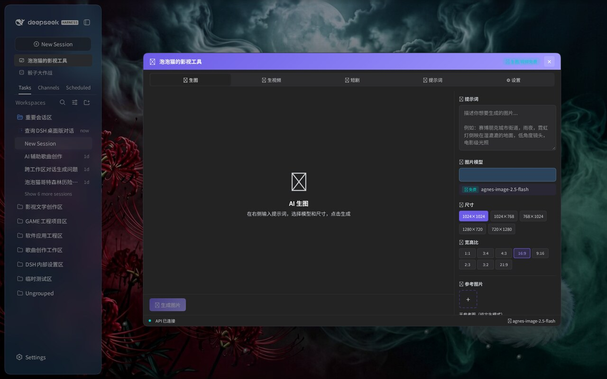

# 🎬 泡泡猫的影视工具 · dsh-agnes-studio

一站式 AI 影视创作工作站，作为 DSH 的全局浮层面板运行——**不占用对话框，边聊边创作**。



## 五大工作区

面板顶部五个标签页，覆盖从灵感到大片的全流程：

| 标签 | 能力 |
|---|---|
| 🎨 **生图** | 文生图、图生图、多图合成；1K–4K 尺寸，8 种宽高比（1:1 / 3:4 / 4:3 / 16:9 / 9:16 / 2:3 / 3:2 / 21:9） |
| 🎬 **生视频** | 文生视频、图生视频；4–12 秒时长，支持首帧控制 |
| 📖 **短剧** | 剧本导入（`.txt` / `.md` / `.json`）自动拆解分镜，故事板预览与批量生成 |
| ✨ **提示词** | 提示词专家：按题材生成、润色、扩写，解决「不知道怎么写提示词」 |
| ⚙ **设置** | 模型管理、自定义模型接入、生成参数偏好 |

## 多厂商支持

代理端点按模型名自动路由到对应厂商 API，一个面板调度六大厂商：

- **Agnes**（默认，生图/生视频免费额度）
- **DeepSeek**
- **Qwen**
- **豆包 Doubao**
- **MiniMax**
- **Ollama**（本地模型，无需 Key，需本机 11434 端口）

## 技术亮点

- **不堵对话框** —— 使用 `shell.overlay` 全局浮层，面板打开时对话框完全可用；标题栏可拖拽，✕ / Esc / 再次点击侧边栏入口均可关闭
- **API Key 安全** —— 所有厂商请求走 **Host 端代理**，密钥由宿主进程读取，浏览器永不接触
- **主题自适应** —— 跟随 DSH 深色/浅色主题
- **生成状态实时反馈** —— 进度条、错误提示、结果预览、一键复制链接

## 安装

```sh
dsh plugin --profile web add dsh-agnes-studio
```

刷新 Web 界面，侧边栏点击「🎬 泡泡猫的影视工具」即可打开。

### 本地开发安装

```sh
git clone https://github.com/zmm863-commits/dsh-agnes-studio
cd dsh-agnes-studio
npm install
npm run build
dsh plugin --profile web add "$(pwd)"
```

## 首次使用：配置 API Key

面板首屏内置引导卡片，三步完成：

1. 注册 / 登录 [Agnes AI 平台](https://platform.agnes-ai.cn)（免费）
2. 在控制台「API Keys」创建密钥，复制 `sk-` 开头的那串
3. 填到本机（任选一种）：
   - DSH 设置 → 模型 → 凭据，新增 `agnes-api-key`
   - 或在 `/dsh/.env` 写入 `AGNES_API_KEY=sk-...`

其他厂商各自的 Key 写入 `.env`（如 `DEEPSEEK_API_KEY=sk-...`）或 DSH 凭据（如 `deepseek-api-key`）。

> Key 只保存在本机、只由后端进程用于调用厂商 API，网页里不会出现；免费额度以各平台规则为准。

## 使用流程

1. 侧边栏点击「🎬 泡泡猫的影视工具」
2. 选择标签页（生图 / 生视频 / 短剧 / 提示词）
3. 输入提示词，选择模型与尺寸/时长，点击生成
4. 短剧模式：导入剧本 → 自动拆解分镜 → 批量生成所有场景
5. 关闭：标题栏 ✕、Esc，或再次点击侧边栏入口

## 许可

MIT
