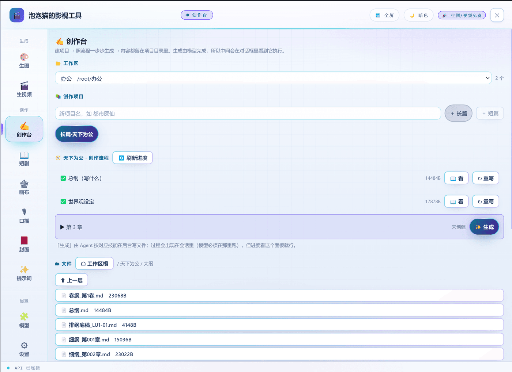
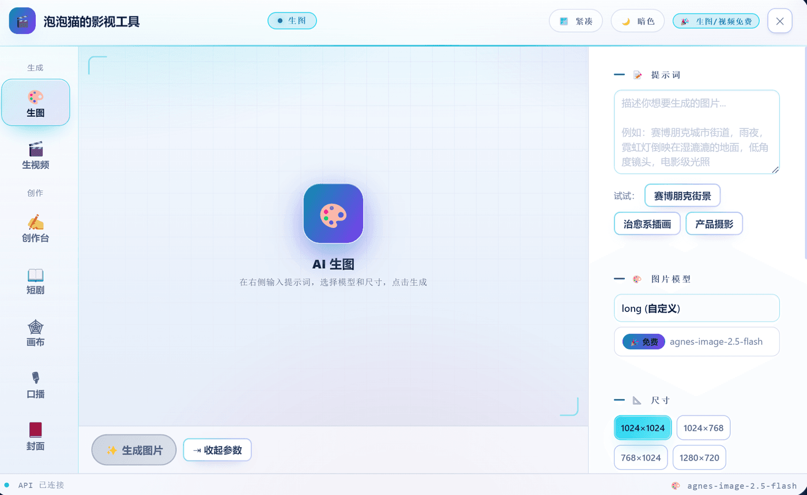
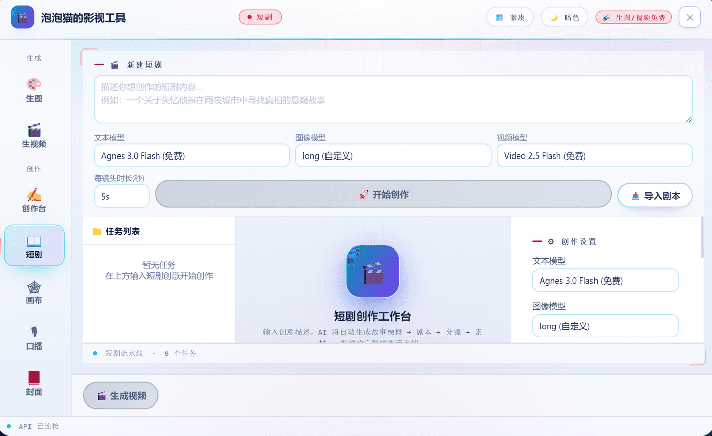
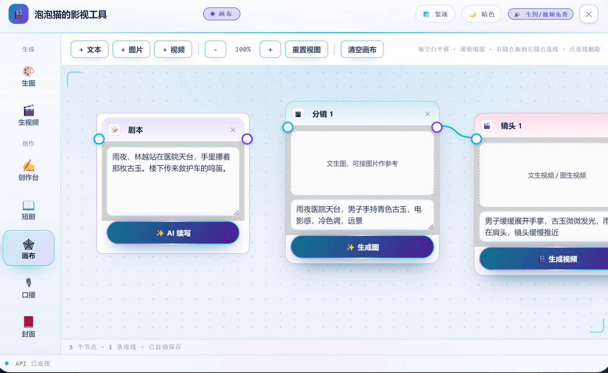

# 🎬 dsh-agnes-studio — 泡泡猫的影视工具

充分利用 Agnes AI 免费生图/视频大模型的 DSH 插件（内部名：Agnes 创意工作站）。

## 界面

| ✍️ 创作台（新增） | 🎨 生图 |
|---|---|
|  |  |

| 📖 短剧 | 🕸 画布 |
|---|---|
|  |  |

## 核心特性

- **🎨 文生图** — Image 2.5 Flash，支持 1K-4K 尺寸，免费
- **🖼 图生图** — 风格迁移、场景变换、多图合成
- **🎬 文生视频** — Video 2.5 Flash，4-12 秒，免费
- **📹 图生视频** — 首帧控制、多模态参考
- **📖 短剧流水线** — 剧本导入 → 分镜 → 逐镜头真实生成 → **自动合成成片**（可烧中文字幕）
- **🎙 数字人口播** — 文稿自动分段 → TTS 配音 → 画面 → 字幕 → 成片
  - 三种画面模式：静态形象图 / 视频素材 / AI 生成画面
  - AI 模式支持**逐段生成画面**（每段台词配一段画面，更贴合内容）
- **🕸 无限画布** — 节点化编排（文本/图片/视频），缩放拖拽、连线传参考图、逐节点真实生成，自动保存
- **📕 小说封面** — 上传 TXT/DOCX 自动提取书名/作者/简介，一键生成 3:4 标准封面
- **✨ 提示词专家** — 中文想法一键扩写成专业中英文提示词
- **✍️ 创作台** — 把 Oh Story 的创作流程搬进面板：选工作区 → 一键建项目（长篇/短篇）→
  **创作流程逐步引导**（总纲 / 世界观 / 正文…，每步显示文件是否已写、自动标出下一步）→
  文件树与编辑器 → **从面板发起创作任务**（写下一章 / 拆文 / 去 AI 味）。
  - 写完后**不用切到对话框**：面板每 3 秒自己检查目标文件，直接显示「正在生成 → ✅ 已完成」
  - 章节步骤是**动态**的：写完一章，按钮自动变成「✍️ 写下一章」，可以一直往下续
- **🧩 模型管理** — 独立成页，列出全部图片/视频模型（每行标注**厂商**与内置/自定义），并可增删自定义 API 兼容模型
- **🕘 生成历史** — 最近 24 条生成结果的缩略图走马灯，刷新页面、重启浏览器都不丢
- **🎚 面板尺寸三档** — 标题栏 🪟 按钮循环切换 **紧凑 / 标准 / 全屏**，选择写进 localStorage
- **📚 Oh Story 创作技能（宿主半）** — 原 `@oh-story/dsh` 的**宿主半**（技能 + 工具）静态并入本包，不再是独立插件行；技能在会话里直接可用。**面板侧的「✦ 创作套件」页签已撤销**（功能不完善），不再占用面板空间：
  - **小说 / 短剧 / 游戏 / 视频** 四个板块，直接读写当前 DSH 会话工作区里的项目文件
  - **短剧 11 技能**：`short-drama` 路由 + develop / write / assets / image-prompts / storyboard / video-prompts / produce / edit / review / novel-analyze
  - **网文 13 技能**：`story` 路由 + long/short 拆文与写作、封面、去 AI 味、导入、审查、扫榜
  - **视频解说 6 技能**：understanding / script / cut / voiceover / assemble / recap
  - **小说改游戏 7 技能**：novel-to-game 及 analyze / concept / world-design / art-direction / build / qa
  - 另含 `oh_story_role`、`oh_story_production`、`oh_story_bundled_reference` 三个工具


## 与 Oh Story 的合并方式（v0.6.0）

合并不是把两份代码混着改，而是**两个 half 各自保持原样、在入口处组合**：

```
lib/host-entry.js   ← build.mjs 生成：agnes 宿主半 + vendor/oh-story 宿主半，apply() 依次调用，
                       inject 取并集（webServer/systemPrompt/credentials + skills/subagents/tools/typert）
lib/index.js        ← tsdown 产物，Agnes 宿主半本身，未改动
lib/client.js       ← build.mjs 生成：同一个文件里两个 __ModuleLoader__ 注册
                       （dsh-agnes-studio 与私有的 dsh-agnes-studio/oh-story），
                       Agnes 工厂用 require() 取到对方工厂并组合 apply()/inject
vendor/oh-story/    ← 上游 ~23MB 原样存放（index.js/client.js/四套技能与角色树），
                       Oh Story 靠自身目录解析技能根，所以必须整树同放
```

两处设计上的取舍：

1. **宿主半没有塞进 `src/index.ts`**：两边都导出 `name`/`apply`，且 vendored 文件必须与其自身目录保持相对关系（技能根 = `dirname(import.meta.url)/<pack>/skills`）。因此新增一个 `lib/host-entry.js` 作为 `main`。
2. **客户端注册用私有 id**：DSH 把全部插件的客户端 bundle 拼成一个 combo 脚本，模块系统禁止重复注册同一 id。若某个 profile 尚未重启、仍把 `@oh-story/dsh` 当独立行加载，原样注册会直接冲突。用 `dsh-agnes-studio/oh-story` 这个私有 id 后，两种 profile 都能正常启动。

> 宿主半改动需要**重启 DSH** 才生效；客户端半刷新页面即可。
> 已并入的实例请把 `@oh-story/dsh` 从 profile 的 `dsh.profile.bundles` 与 `dependencies` 中移除，避免技能重复注册。


## 环境依赖

短剧合成与口播需要本机具备：

| 依赖 | 用途 | 缺失时 |
|---|---|---|
| **ffmpeg + ffprobe** | 视频拼接、字幕烧录、音画合成 | 面板顶部提示安装方法；可设 `AGNES_FFMPEG` 指定路径 |
| **中文字体** | 烧录中文字幕 | 明确报错（不会静默输出豆腐块）；可设 `AGNES_SUBTITLE_FONT` |
| **MIMO_API_KEY** | 口播 TTS 配音 | 口播页提示配置（`mimo-api-key` 凭据或环境变量） |

安装 ffmpeg：
```bash
# Linux
apt-get install -y ffmpeg fonts-wqy-zenhei
# macOS
brew install ffmpeg && brew install --cask font-noto-sans-cjk-sc
# Windows: 安装 ffmpeg 加入 PATH（或设 AGNES_FFMPEG），系统自带微软雅黑即可
```

## 技术亮点

- **不堵对话框** — 使用 `shell.overlay` 浮层，对话框完全可用
- **API Key 安全** — 走 Host 端代理，浏览器不暴露 Key
- **真实可用性验证** — 生图/生视频/拼接/TTS/字幕全部有端到端实测脚本
- **字幕按真实像素排版** — 用 ASS + `PlayResY` 声明分辨率，字号/边距不受 libass 默认 288 行缩放影响
- **拼接自动归一化** — 镜头分辨率或帧率不一致时逐个归一化再拼，避免时间轴错乱


## 安装

```bash
cd /dsh/profiles/web
npm install /root/软件/dsh-agnes-studio
# 编辑 package.json 的 dsh.profile.bundles 添加 "dsh-agnes-studio"
# 编辑 package.json 的 dependencies 添加 "dsh-agnes-studio": "file:/root/软件/dsh-agnes-studio"
# 若 profile 里还有 "@oh-story/dsh"：从 bundles 和 dependencies 中移除（能力已并入），否则技能会重复注册
# 重启 DSH 容器
```

## 首次使用：获取 Agnes API Key

1. 打开 <https://platform.agnes-ai.cn> 注册 / 登录（免费）
2. 在控制台「API Keys」创建密钥，复制 `sk-` 开头的那串
3. 填到本机（任选一种）：
   - 在 DSH 设置 → 模型 → 凭据 中新增 `agnes-api-key`
   - 或在本机 `/dsh/.env` 写入 `AGNES_API_KEY=sk-...`

面板首屏会显示同样的指引；Key 只由宿主进程读取，浏览器不会接触。

## 使用

1. 侧边栏点击「🎬 泡泡猫的影视工具」
2. **生图 / 生视频**：输入提示词（或点「试试：」下的示例一键填入），选模型与尺寸，点击生成
3. **短剧**：剧本导入 → 生成分镜 → 「一键生成全部镜头」→「合成成片」（可选烧字幕）→ 下载
4. **口播**：切到「🎙 口播」→ 输入文稿 → 选形象图 → 开始生成 → 预览/下载
5. **画布**：切到「🕸 画布」→ 拖空白平移、滚轮缩放、节点右圆点拖到左圆点连线（图片节点连到视频节点即作为参考图）→ 节点上直接生成
6. **封面**：切到「📕 封面」→ 上传 TXT/DOCX 或手填书名 → 选风格 → 生成封面
7. **提示词**：切到「✨ 提示词」→ 选专家类型 → 中文想法 → 生成中英文提示词
8. **创作台**：切到「✍️ 创作台」→ 选工作区 → 输入名字建项目 → 照流程逐步点「✨ 生成」→ 点「🔄 刷新进度」看结果
9. **模型**：切到「🧩 模型」→ 查看全部可用模型（标注厂商）→ 增删自定义模型
10. **设置**：切到「⚙ 设置」→ 查看各厂商 API Key 状态与配置指引
11. 关闭：标题栏 ✕、Esc，或再次点击侧边栏入口

> **导航分三组**：生成（生图 / 生视频）· 创作（短剧 / 画布 / 口播 / 封面 / 提示词）· 配置（模型 / 设置）。
> **标题栏 🪟** 切换面板尺寸；**生图/生视频右侧参数栏**可点「⇥ 收起参数」让预览占满。

> ⚠️ 改动了插件**宿主半**（`lib/index.js`）后需**重启 DSH** 才生效；只改客户端刷新页面即可。
> 画布状态保存在浏览器 localStorage，无需后端。


